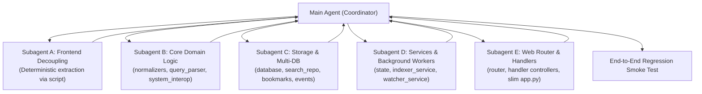

# Master Refactoring & Decoupling Runbook: Indexer Platform

> **Status:** Draft / Pending Approval  
> **Target Date:** 2026-09-25  
> **Source Baseline:** Monolithic `app.py` (7,206 lines) + `indexer_engine.py` (~700 lines)  
> **Target State:** Modular Zero-Dependency Package (<80 lines in `app.py`)  
> **Session Hand-off State:** Clean, self-contained checklist. Any agent starting in this workspace must check off items sequentially.

---

## 1. Executive Summary & Architecture Blueprint

### 1.1 Why We Are Refactoring
The current `app.py` has grown into a 7,206-line single-file monolith containing:
- **~1,627 lines** of core backend utilities, database schema, search queries, thread pools, and file watching.
- **~4,773 lines** of an embedded string (`HTML_TEMPLATE`) containing CSS (~1,562 lines), HTML DOM (~717 lines), and client JavaScript (~2,482 lines).
- **~803 lines** of HTTP dispatching (`RequestHandler`) using long `if/elif` ladders.

### 1.2 Target Project Tree
```text
/home/essam/Projects/Indexer/
├── config.py                 # Paths, port, APP_CONFIG, WATCHER_SETTINGS, DB directory
├── indexer_engine.py         # File parser & extractor (untouched / intact)
│
├── core/                     # Pure domain logic (ZERO HTTP / DB dependencies)
│   ├── __init__.py
│   ├── normalizers.py        # Arabic normalization, phone heuristics, fuzzy distance
│   ├── query_parser.py       # Google-style query tokenizer & grammar
│   └── system_interop.py     # OS-level openers (xdg-open, LibreOffice Calc, zenity dialogs)
│
├── storage/                  # SQLite Data Access Layer (Repository Pattern)
│   ├── __init__.py
│   ├── database.py           # Multi-DB routing, connection pool, WAL mode, migrations
│   ├── search_repository.py  # FTS5 search, trigram matching, telecom CDR queries, stats
│   ├── bookmarks.py          # Bookmark CRUD & context window queries
│   └── events.py             # Change tracking and notification audit logs
│
├── services/                 # Concurrency & background workers
│   ├── __init__.py
│   ├── state.py              # Thread-safe global state (INDEX_STATE, INDEX_LOCK, WATCHER_CONFIG)
│   ├── indexer_service.py    # Recursive directory indexing coordinator & background threads
│   └── watcher_service.py    # File system watcher thread & loop
│
├── web/                      # HTTP & API transport layer
│   ├── __init__.py
│   ├── server.py             # HTTPServer lifecycle bootstrapper
│   ├── router.py             # Route registry & path dispatcher
│   └── handlers/             # Modular endpoint controllers
│       ├── __init__.py
│       ├── static_handlers.py    # Static file delivery (with path traversal security guards)
│       ├── search_handlers.py    # /api/search, /api/context, /api/stats, /api/filters
│       ├── database_handlers.py  # /api/databases, /api/databases/switch, /rename, /delete
│       ├── settings_handlers.py  # /api/settings, /api/settings/save
│       ├── bookmark_handlers.py  # /api/bookmarks, /api/bookmarks/add, /remove
│       ├── image_handlers.py     # /api/image/view, /api/image/boxes
│       └── system_handlers.py    # /api/index/*, /api/watch/*, /api/dialog/*, /api/backup
│
├── static/                   # Decoupled frontend assets
│   ├── css/
│   │   └── app.css           # Complete extracted stylesheet (~1,562 lines)
│   └── js/
│       └── app.js            # Complete extracted client application (~2,482 lines)
│
├── templates/
│   └── index.html            # Clean HTML skeleton linking static assets (~717 lines)
│
├── tests/                    # Automated regression test suite
│   ├── test_normalizers.py   # Arabic & phone normalization tests
│   ├── test_storage.py       # Multi-database connection & query tests
│   └── test_api.py           # Endpoint sanity tests
│
├── .agents/                  # Agent instructions, rules, and skills
│   ├── rules/
│   │   └── indexer-rules.md  # Architectural constraints (Zero external pip deps)
│   └── skills/
│       └── indexer-workflows/SKILL.md # Operational workflows & commands
│
└── app.py                    # Clean bootstrap entry point (< 80 lines)
```

---

## 2. Agent Operational Directives & Safety Guardrails (CRITICAL)

Any AI agent working on this refactoring **MUST** strictly adhere to the following rules:

> [!CAUTION]
> 1. **Zero LLM Token Streaming of Frontend Code:**
>    - The agent must **NEVER** write or re-generate the 4,770+ lines of HTML/CSS/JS through chat tokens. Doing so causes truncated blocks, omitted event handlers, and syntax errors.
>    - **Requirement:** Extraction of CSS, JS, and HTML from `HTML_TEMPLATE` must be performed via a **deterministic Python slicing script** operating directly on the file system.
> 2. **Global Window Scope Protection in JavaScript:**
>    - The frontend relies on global functions and variables (e.g. `switchDatabase`, `openFolderModal`, inline `onclick="showImagePreview(...)"`).
>    - **Requirement:** Keep the extracted JavaScript in `static/js/app.js` with all functions bound to global scope. Do NOT convert to strict isolated ES modules or bundlers.
> 3. **Strict Zero-External-Pip-Dependencies:**
>    - Standard library only (`http.server`, `sqlite3`, `zipfile`, `subprocess`, `threading`, `json`, etc.). No FastAPI, Flask, Pandas, Requests, or Pydantic.
> 4. **Verbatim Code Migration First:**
>    - Do not "optimize" or rewrite working query/normalization algorithms during file relocation. Move functions verbatim first, test, and only refactor once proven identical.
> 5. **Checkpoint Verification After Every Step:**
>    - After each phase, compile with `python3 -m py_compile`, start the server, and verify with `curl`. If anything fails, fix it before moving to the next phase.

---

## 3. Subagent Work Distribution Strategy

To prevent agent context exhaustion or cognitive overload, work is partitioned into discrete, independent subtasks:



- **Coordinator Responsibilities:** Maintains git branches, creates checkpoints, reviews subagent output, and runs verification test suites.
- **Subagent Delegation:** Subagents operate with isolated, focused scopes and write unit tests for their specific modules.

---

## 4. Detailed Step-by-Step Checkmarks & Progress Tracker

### Phase 0: Safety & Environment Preparation
- [x] **Task 0.1:** Verify working directory is clean or stash changes.
- [x] **Task 0.2:** Create safety git branch: `git checkout -b refactor/modular-architecture`.
- [x] **Task 0.3:** Verify active database (`sheets_index.db`) has a backup copy (`sheets_index.db.snap_*`).
- [x] **Task 0.4:** Compile check: `python3 -m py_compile app.py indexer_engine.py index_sheets.py search.py`.

---

### Phase 1: Frontend Decoupling (Presentation Layer)
- [x] **Task 1.1:** Create required directories: `mkdir -p static/css static/js templates`.
- [x] **Task 1.2:** Write and run a deterministic Python extraction script (`extract_frontend.py`):
  - Slice CSS lines (between `<style>` and `</style>`) into `static/css/app.css`.
  - Slice JS lines (between `<script>` and `</script>`) into `static/js/app.js`.
  - Slice HTML DOM lines, replace `<style>` with `<link rel="stylesheet" href="/static/css/app.css">` and `<script>` with `<script src="/static/js/app.js"></script>`, and save to `templates/index.html`.
- [x] **Task 1.3:** Update `app.py`:
  - Replace raw 4,773-line `HTML_TEMPLATE` with a lightweight function `get_html_template()` reading `templates/index.html`.
  - Add static file handler to `RequestHandler.do_GET` serving `/static/css/*` and `/static/js/*` with path traversal guards (`os.path.commonpath`).
- [x] **Task 1.4:** **Milestone 1 Verification:**
  - Launch `python3 -u app.py`.
  - Run `curl -I http://localhost:8088/` $\rightarrow$ expect `200 OK` (`text/html`).
  - Run `curl -I http://localhost:8088/static/css/app.css` $\rightarrow$ expect `200 OK` (`text/css`).
  - Run `curl -I http://localhost:8088/static/js/app.js` $\rightarrow$ expect `200 OK` (`application/javascript`).
  - Commit milestone: `git commit -m "refactor(phase-1): decouple frontend assets into templates and static files"`.

---

### Phase 2: Extract Pure Domain Helpers (`core/`)
- [x] **Task 2.1:** Create `core/` package: `mkdir -p core tests && touch core/__init__.py`.
- [x] **Task 2.2:** Extract `core/normalizers.py`:
  - `normalize_phone(val)`
  - `normalize_arabic(text)`
  - `levenshtein_dist(s1, s2)`
- [x] **Task 2.3:** Extract `core/query_parser.py`:
  - `parse_google_query(query_str)`
  - `tokenize_query(query)`
- [x] **Task 2.4:** Extract `core/system_interop.py`:
  - `open_in_app(file_path, sheet_name, row_idx)`
  - `reveal_in_folder(file_path)`
  - Dialog runner functions for `zenity` and `kdialog`.
- [x] **Task 2.5:** Update `app.py` to import from `core.*`.
- [x] **Task 2.6:** **Milestone 2 Verification:**
  - Create `tests/test_normalizers.py` asserting Arabic normalization (`أحمد` $\leftrightarrow$ `احمد`, diacritic stripping) and phone normalization (`+2010...` $\leftrightarrow$ `010...`).
  - Run `python3 -m unittest tests/test_normalizers.py` $\rightarrow$ must pass with 0 errors.
  - Commit milestone: `git commit -m "refactor(phase-2): extract domain normalizers and system interop into core"`.

---

### Phase 3: Extract Data Access Layer & Multi-DB (`storage/`)
- [x] **Task 3.1:** Create `storage/` package: `mkdir -p storage && touch storage/__init__.py`.
- [x] **Task 3.2:** Extract `storage/database.py`:
  - `get_active_db_path()`
  - Connection factory `get_db_connection(db_path=None)` with WAL mode and pragmas.
  - Table initialization & migrations (`init_db`, `ensure_tables`).
- [x] **Task 3.3:** Extract `storage/search_repository.py`:
  - `query_db(query, limit, offset, scope_file, scope_folder, mode)`
  - `get_stats()`
  - `get_quick_filters()`, `add_quick_filter()`, `delete_quick_filter()`
- [x] **Task 3.4:** Extract `storage/bookmarks.py`:
  - `get_bookmarks()`, `add_bookmark()`, `remove_bookmark()`
  - `get_context_window(file_path, sheet_name, row_idx, radius)`
- [x] **Task 3.5:** Extract `storage/events.py`:
  - `record_change_event(event_type, file_path, details)`
  - `get_change_events(limit, offset, unread_only)`
  - `mark_change_events_read(event_ids)`
- [x] **Task 3.6:** Update `app.py` to route queries via `storage.*`.
- [x] **Task 3.7:** **Milestone 3 Verification:**
  - Run test query against `sheets_index.db` via `storage.search_repository.query_db`.
  - Verify database switcher endpoint (`/api/databases`) functions accurately.
  - Commit milestone: `git commit -m "refactor(phase-3): extract sqlite repositories and multi-db management into storage"`.

---

### Phase 4: Concurrency & Background Services (`services/`)
- [x] **Task 4.1:** Create `services/` package: `mkdir -p services && touch services/__init__.py`.
- [x] **Task 4.2:** Extract `services/state.py`:
  - Encapsulate `INDEX_STATE`, `INDEX_LOCK`, `WATCHER_CONFIG`, `APP_CONFIG`.
  - Provide thread-safe state getters and setters (`set_index_progress`, `is_indexing_running`).
- [x] **Task 4.3:** Extract `services/indexer_service.py`:
  - `start_indexing_thread(folder, nickname, db_key, wipe_first)`
  - Integration with `indexer_engine.py`.
- [x] **Task 4.4:** Extract `services/watcher_service.py`:
  - `folder_watcher_loop()` with poll interval, debounce delay, and file size limits.
  - `start_watcher_thread()`, `toggle_watcher()`.
- [x] **Task 4.5:** **Milestone 4 Verification:**
  - Test starting/stopping watcher thread cleanly without race conditions.
  - Commit milestone: `git commit -m "refactor(phase-4): isolate background worker threads and state into services"`.

---

### Phase 5: Web Routing, Handlers & Slim Entry Point (`web/` & `app.py`)
- [x] **Task 5.1:** Create `web/` and `web/handlers/`:
  - `mkdir -p web/handlers && touch web/__init__.py web/handlers/__init__.py`.
- [x] **Task 5.2:** Implement `web/router.py`:
  - Clean URL dispatcher matching `(method, path)` pairs or regex patterns to handler callables.
- [x] **Task 5.3:** Implement discrete handler modules in `web/handlers/`:
  - `static_handlers.py`: Serves HTML template, CSS, JS, and image thumbnails.
  - `search_handlers.py`: Handles `/api/search`, `/api/context`, `/api/stats`, `/api/filters`.
  - `database_handlers.py`: Handles `/api/databases`, `/api/databases/switch`, `/rename`, `/delete`.
  - `settings_handlers.py`: Handles `/api/settings`, `/api/settings/save`.
  - `bookmark_handlers.py`: Handles `/api/bookmarks/*`.
  - `system_handlers.py`: Handles indexing triggers, watcher toggle, desktop launchers.
- [x] **Task 5.4:** Implement `web/server.py`:
  - Standard `HTTPServer` wrapper using the router.
- [x] **Task 5.5:** Refactor root `app.py` into a minimal entry point (< 80 lines):
  - Load config, start background watcher, bind HTTP server, handle graceful SIGINT/SIGTERM shutdown.
- [x] **Task 5.6:** **Milestone 5 Verification:**
  - `python3 -m py_compile app.py web/*.py web/handlers/*.py`.
  - Commit milestone: `git commit -m "refactor(phase-5): implement modular web router and slim down app.py"`.

---

### Phase 6: End-to-End Regression Smoke Test
- [x] **Check 6.1:** Web GUI loads at `http://localhost:8088/` with full dark-mode styling and icons.
- [x] **Check 6.2:** Universal Search works in General Mode (returns document cards, highlights matches).
- [x] **Check 6.3:** Telecom CDR Mode works (filters caller, callee, duration, cells).
- [x] **Check 6.4:** Database Switcher dropdown lists databases, switches active DB on the fly without server restart.
- [x] **Check 6.5:** Settings Modal loads and saves custom storage folder and watcher intervals.
- [x] **Check 6.6:** Image OCR preview and bounding boxes render correctly.
- [x] **Check 6.7:** Background watcher detects and records file modifications in notification hub.
- [x] **Check 6.8:** CLI tools (`index_sheets.py`, `search.py`) execute properly against the new package structure.
- [x] **Check 6.9:** Commit final checkpoint: `git commit -m "refactor(complete): fully decoupled modular architecture with verified regression tests"`.

---

### Phase 7: Deep Engine De-bloating, Unified Parsing & Anti-AI-Bloat Guardrails
- [x] **Task 7.1:** Extract pure Python parsers into decoupled `parsing/` module:
  - `parsing/spreadsheet_parser.py`: `.xlsx` (zipfile + xml.etree streaming), `.csv`, `.xls` (LibreOffice / binary fallback).
  - `parsing/document_parser.py`: `.docx`, `.odt`, `.txt`, `.pdf` (pdftotext + OCR fallback), image wrappers.
  - `parsing/ocr_parser.py`: ImageMagick preprocessing pipeline and Tesseract TSV bounding box extractor.
  - `parsing/__init__.py`: Central `parse_document()` dispatcher.
- [x] **Task 7.2:** Clean `indexer_engine.py`:
  - Eliminate nested repetitive function definitions (`_extract_cell_value` made top-level static).
  - Delegate schema creation directly to `storage.init_tables()`.
  - Remove redundant inline normalization functions.
- [x] **Task 7.3:** Web API Standardization:
  - Create `web/http_utils.py` providing unified JSON request parsing, response formatting, and error handling.
  - Refactor all 6 web handlers to use `http_utils.py`, removing ~200 lines of duplicate serialization.
  - Fix missing `/api/search/csv` endpoint for frontend CSV search export.
- [x] **Task 7.4:** CLI Unification:
  - Refactor `search.py` to route through `storage.query_db()` and `core.system_interop.open_in_app()`.
- [x] **Task 7.5:** Automated Test Suite Expansion:
  - Created `tests/test_parsing.py` for `.xlsx`, `.csv`, `.docx`, and `.txt` parsing verification.
  - Run all 20 tests: `python3 -m unittest discover tests/` $\rightarrow$ 20/20 PASS.

---

## 5. Session Hand-off & Recovery Protocol
If an autonomous agent is interrupted or a session closes unexpectedly:
1. Run `git status` and `git log -n 3` to determine the latest completed phase.
2. Check the test suite: `python3 -m unittest discover tests`.
3. Check this document (`REFACTORING_RUNBOOK.md`) for unchecked boxes.
4. Continue strictly from the first unchecked task without modifying completed packages.
